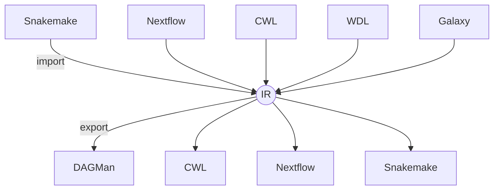

# wf2wf – Universal Workflow-Format Converter

[](https://www.python.org/downloads/)
[](https://github.com/your-org/wf2wf/actions/workflows/ci.yml)
[](https://pypi.org/project/wf2wf)
[](https://codecov.io/gh/your-org/wf2wf)
[](LICENSE)
[](wf2wf/schemas/v0.1/wf.json)
[](wf2wf/schemas/v0.1/loss.json)

`wf2wf` is a **format-agnostic converter**: any supported engine → **Intermediate Representation (IR)** → any other engine.  The core library handles

• Snakemake • DAGMan • CWL • Nextflow • WDL • Galaxy  
plus regulatory artefacts such as **BioCompute Objects**.



## 🚀 Quick CLI tour

```bash
# Convert Snakemake → DAGMan and auto-generate Markdown report
wf2wf convert -i Snakefile -o pipeline.dag --auto-env build --interactive \
              --report-md

# Sign & package into FDA eSTAR bundle
wf2wf bco sign pipeline.bco.json --key priv.pem --interactive
wf2wf bco package pipeline.bco.json --format estar --interactive

# Validate and view loss summary
wf2wf validate pipeline.dag
```

Interactive prompts (`--interactive`) use `y/n/always/quit`; severity-aware loss prompts appear only for *warn/error* losses.

## 📦 Installation

```bash
# PyPI
pip install wf2wf

# or conda-forge (once feedstock is merged)
conda install -c conda-forge wf2wf
```

Dev setup:

```bash
git clone https://github.com/your-org/wf2wf.git && cd wf2wf
pip install -e .[dev]
pre-commit install
pytest -q
```

## 🚀 Quick Start

```bash
# Convert CWL → Snakemake
wf2wf convert -i workflow.cwl -o Snakefile --out-format snakemake --report-md

# Inspect information loss
wf2wf validate Snakefile

# Build environments & push images (interactive prompts enabled)
wf2wf convert -i Snakefile -o pipeline.dag --auto-env build --push-registry ghcr.io/myorg --interactive
```

## 📋 Table of Contents

- [Features](#-features)
- [Installation](#-installation)
- [Usage Examples](#-usage-examples)
- [Configuration](#-configuration)
- [Supported Snakemake Features](#-supported-snakemake-features)
- [Resource Management](#-resource-management)
- [Environment Management](#-environment-management)
- [Troubleshooting](#-troubleshooting)
- [Contributing](#-contributing)

## ✨ Features

### Core Capabilities
- **🔄 Complete Workflow Conversion**: Converts entire Snakemake workflows to HTCondor DAG format
- **📊 Dependency Preservation**: Maintains exact job dependencies and execution order
- **🎯 Wildcard Support**: Handles complex wildcard patterns and expansions
- **📦 Resource Translation**: Converts Snakemake resource requests to HTCondor specifications
- **🐍 Run Block Conversion**: Transforms Python `run:` blocks into standalone scripts
- **📝 Script Generation**: Creates wrapper scripts for all job types

## 🧩 How wf2wf builds the DAG

`wf2wf` gathers information in three layers:
1. **Rule templates – parsed directly from the Snakefile.**
2. **`snakemake --dag` (mandatory)** – prints the full dependency graph in DOT format.  
   If this step fails the conversion stops.
3. **`snakemake --dry-run` (optional enrichment)** – adds wildcard values and
   resource numbers.  Failure here only results in less-detailed submit files.

In short: make sure  
```
snakemake --dag --snakefile <yourfile>
```  
runs without errors (input data do *not* need to exist).  
The `--dry-run` call is helpful but not required.


### Environment Management
- **🐳 Docker Integration**: Automatic Docker image building and registry management
- **📦 Apptainer/Singularity Support**: Converts Docker images to `.sif` files for HPC clusters
- **🐍 Conda Environment Handling**: Multiple strategies for conda environment management
- **🔧 Container Priority**: Intelligent handling of mixed container and conda directives

### Production Features
- **⚡ Robust Error Handling**: Graceful degradation and comprehensive error reporting
- **🔍 Verbose Logging**: Detailed debugging and progress information
- **⚙️ Flexible Configuration**: JSON-based configuration with CLI overrides
- **🧪 Comprehensive Testing**: Extensive test suite covering edge cases
- **📚 Rich Documentation**: Complete examples and troubleshooting guides

## 🛠 Installation

### Universal Prerequisites
- Python 3.7+

### Workflow Prerequisites
- Snakemake 6.0+
- HTCondor (for job submission)

### Optional Dependencies
- Docker (for containerization features)
- Apptainer/Singularity (for HPC container conversion)

### Install
```bash
# Clone the repository
git clone <repository_url>
cd wf2wf

# Install Python dependencies
pip install snakemake pyyaml

# Verify installation
python wf2wf.py --help
```

## 📖 Usage Examples

### Example 1: Basic Workflow Conversion

**Snakefile:**
    ```python
rule all:
    input: "results/final.txt"

rule process_data:
    input: "data/input.txt"
    output: "results/processed.txt"
    resources:
        mem_mb=4000,
        disk_gb=10
    shell: "process_tool {input} > {output}"

rule summarize:
    input: "results/processed.txt"
    output: "results/final.txt"
    shell: "summarize_tool {input} > {output}"
```

**Conversion:**
    ```bash
python snakemake_to_dag.py \
        --snakefile Snakefile \
    --out workflow.dag \
        --generate-scripts \
    --default-memory 2GB \
    --default-disk 5GB \
    --verbose
```

### Example 2: GPU-Enabled Workflow

**Snakefile:**
```python
rule train_model:
    input: "data/training_set.csv"
    output: "models/trained_model.pkl"
    resources:
        gpu=2,
        gpu_mem_mb=16000,
        gpu_capability=7.5,
        mem_gb=32,
        threads=8
    conda: "envs/ml_environment.yaml"
    shell: "python train.py --input {input} --output {output} --gpus 2"
```

**Conversion with Auto-Containerization:**
```bash
python wf2wf.py \
    --snakefile Snakefile \
    --auto-docker-build \
    --docker-registry docker.io/myusername \
    --apptainer-sif-dir /shared/containers \
    --generate-scripts \
    --verbose
```

### Example 3: Complex Workflow with Multiple Environments

**Snakefile:**
```python
rule preprocess:
    input: "raw_data.txt"
    output: "clean_data.txt"
    conda: "envs/preprocessing.yaml"
    resources: mem_gb=8
    shell: "preprocess.py {input} {output}"

rule analyze:
    input: "clean_data.txt"
    output: "analysis_results.json"
    container: "docker://bioconductor/bioconductor_docker:latest"
    resources: mem_gb=16, threads=4
    script: "scripts/analyze.R"

rule visualize:
    input: "analysis_results.json"
    output: "plots/visualization.png"
    run:
        import matplotlib.pyplot as plt
        import json
        
        with open(input[0]) as f:
            data = json.load(f)
        
        plt.figure(figsize=(10, 6))
        plt.plot(data['values'])
        plt.savefig(output[0])
```

## ⚙️ Configuration

### Configuration File (`.wf2wf.json`)

Create a configuration file in your workflow directory for persistent settings:

```json
{
    "default_memory": "8GB",
    "default_disk": "20GB",
    "default_cpus": 2,
    "scripts_dir": "condor_scripts",
    "conda_prefix": "/shared/conda/envs",
    "docker_registry": "myregistry.com/myproject",
    "condor_attributes": {
        "requirements": "(OpSysAndVer == \"CentOS7\")",
        "+WantGPULab": "true",
        "+GPUJobLength": "short",
        "rank": "Memory"
    }
}
```

### Command-Line Options

| Option | Description | Example |
|--------|-------------|---------|
| `--snakefile` | Path to Snakefile | `--snakefile workflow.smk` |
| `--out` | Output DAG filename | `--out my_workflow.dag` |
| `--generate-scripts` | Generate job wrapper scripts | `--generate-scripts` |
| `--scripts-dir` | Directory for generated scripts | `--scripts-dir scripts/` |
| `--workdir` | Working directory | `--workdir /path/to/work` |
| `--configfile` | Snakemake config file | `--configfile config.yaml` |
| `--default-memory` | Default memory request | `--default-memory 4GB` |
| `--default-disk` | Default disk request | `--default-disk 10GB` |
| `--default-cpus` | Default CPU request | `--default-cpus 2` |
| `--auto-conda-setup` | Auto-create conda environments | `--auto-conda-setup` |
| `--conda-prefix` | Conda environment directory | `--conda-prefix /shared/envs` |
| `--auto-docker-build` | Build Docker images automatically | `--auto-docker-build` |
| `--docker-registry` | Docker registry for images | `--docker-registry docker.io/user` |
| `--apptainer-sif-dir` | Directory for .sif files | `--apptainer-sif-dir /shared/sifs` |
| `--condor-attributes` | Custom Condor attributes (JSON) | `--condor-attributes '{"key":"value"}'` |
| `--verbose` | Enable verbose output | `--verbose` |
| `--debug` | Enable debug output | `--debug` |

## 🎯 Supported Snakemake Features

### ✅ Fully Supported
- **Basic Rules**: `input`, `output`, `shell`, `script`
- **Wildcards**: Pattern matching and expansion
- **Resources**: `mem_mb`, `mem_gb`, `disk_mb`, `disk_gb`, `threads`, `gpu`, `gpu_mem_mb`, `gpu_capability`
- **Conda Environments**: `conda:` directive with automatic setup options
- **Containers**: `container:` directive (Docker, Singularity)
- **Run Blocks**: Python `run:` blocks converted to scripts
- **Dependencies**: Complex dependency graphs including fan-in/fan-out
- **Configuration**: `configfile` and `config` dictionary
- **Parameters**: `params:` directive
- **Retries**: `retries:` directive converted to DAGMan RETRY
- **Local Rules**: `localrules:` for submit-node execution

### ⚠️ Partially Supported
- **Checkpoints**: Basic support, complex dynamic workflows may need manual review
- **Notebooks**: Jupyter notebook integration (experimental)
- **Benchmarks**: Benchmark files are noted but not automatically processed

### ❌ Not Supported
- **Dynamic Rules**: `dynamic()` output (Snakemake limitation in DAG mode)
- **Pipes**: `pipe()` output (not compatible with distributed execution)
- **Shadow Rules**: `shadow:` directive
- **Modules**: Snakemake modules system

## 💾 Resource Management

### Memory and Disk
```python
# Snakemake
resources:
    mem_mb=8000,      # 8GB memory
    disk_gb=50        # 50GB disk

# Converts to HTCondor
request_memory = 8000MB
request_disk = 50GB
```

### CPU and Threading
```python
# Snakemake
threads: 8
resources:
    threads=8

# Converts to HTCondor
request_cpus = 8
```

### GPU Resources
```python
# Snakemake
resources:
    gpu=2,                    # Number of GPUs
    gpu_mem_mb=24000,        # GPU memory per GPU
    gpu_capability=8.0       # Minimum CUDA capability

# Converts to HTCondor
request_gpus = 2
gpus_minimum_memory = 24000
gpus_minimum_capability = 8.0
```

## 🐍 Environment Management

### Strategy 1: Manual Setup (Default)
- Assumes conda environments are pre-installed
- Generates scripts with `conda run` commands
- Requires manual environment setup on compute nodes

### Strategy 2: Automatic Conda Setup
```bash
python wf2wf.py \
    --snakefile workflow.smk \
    --auto-conda-setup \
    --conda-prefix /shared/conda/envs
```
- Creates dedicated setup jobs for each unique environment
- Requires shared filesystem accessible to all compute nodes
- Setup jobs run before dependent computation jobs

### Strategy 3: Docker Containerization (Recommended)
```bash
python wf2wf.py \
    --snakefile workflow.smk \
    --auto-docker-build \
    --docker-registry docker.io/username
```
- Builds Docker images for each unique conda environment
- Pushes images to specified registry
- Jobs run in containerized environments

### Strategy 4: Apptainer/Singularity (Best for HPC)
```bash
python wf2wf.py \
    --snakefile workflow.smk \
    --auto-docker-build \
    --docker-registry docker.io/username \
    --apptainer-sif-dir /shared/containers
```
- Builds Docker images and converts to `.sif` files
- Optimized for HPC cluster performance
- Reduces registry load and improves job startup time

## 🔧 Troubleshooting

### Common Issues

**Issue**: `snakemake --dag` fails
```
ERROR: 'snakemake --dag' failed with exit code 1
```
**Solution**: Check Snakefile syntax and ensure all input files exist or are generated by rules.

**Issue**: Missing conda environments
```
WARNING: Conda environment file not found: environment.yaml
```
**Solution**: Ensure conda environment files exist and paths are correct relative to the Snakefile.

**Issue**: Docker build failures
```
ERROR: Docker build failed for environment.yaml
```
**Solution**: Check Docker daemon is running and you have push permissions to the registry.

**Issue**: Resource allocation errors
```
WARNING: Invalid memory specification: 'invalid_value'
```
**Solution**: Use valid units (MB, GB) and numeric values for resource specifications.

### Debug Mode

Enable debug mode for detailed troubleshooting:
```bash
python wf2wf.py --snakefile workflow.smk --debug --verbose
```

### Validation

Test your workflow before conversion. For example, with Snakemake:
```
bash
# Dry-run to check workflow validity
snakemake --dry-run --snakefile workflow.smk

# Generate DAG to check dependencies
snakemake --dag --snakefile workflow.smk | dot -Tpng > workflow.png
```

## 📊 Examples Directory

The `examples/` directory contains comprehensive test cases for different workflow formats:

* Snakemake example files in `examples/snake`:
    - `linear.smk` - Basic linear workflow
    - `wildcards.smk` - Wildcard expansion patterns
    - `resources.smk` - Resource allocation examples
    - `gpu.smk` - GPU resource requests
    - `advanced.smk` - Container and conda integration
    - `run_block.smk` - Python run block conversion
    - `scatter_gather.smk` - Complex dependency patterns
    - `checkpoint.smk` - Dynamic workflow features
    - `localrules.smk` - Local rule handling
    - `notebook.smk` - Jupyter notebook integration
    - `full_workflow/` - Comprehensive realistic example

* DAGMAN example files in `examples/dagman`:

* CWL example files in `examples/cwl`:

* Nextflow example files in `examples/nextflow`:


## 🧪 Testing

Run the comprehensive test suite:
```bash
# Run all tests
python -m pytest tests/ -v

# Run specific test categories
python -m pytest tests/test_conversions.py::TestConversions::test_linear_workflow_conversion -v

# Run with coverage
python -m pytest tests/ --cov=wf2wf --cov-report=html
```

## 🤝 Contributing

1. Fork the repository
2. Create a feature branch (`git checkout -b feature/amazing-feature`)
3. Add tests for new functionality
4. Ensure all tests pass (`python -m pytest`)
5. Commit changes (`git commit -m 'Add amazing feature'`)
6. Push to branch (`git push origin feature/amazing-feature`)
7. Open a Pull Request

### Development Setup
```bash
git clone <repository_url>
cd wf2wf
pip install -e .
pip install pytest pytest-cov
```

## 📄 License

This project is licensed under the MIT License - see the [LICENSE](LICENSE) file for details.

## 🙏 Acknowledgments

- [Snakemake](https://snakemake.readthedocs.io/) - The workflow management system that inspired this tool
- [Nextflow]() - A workflow management system inconverted through this tool
- [CWL]() - A workflow management system inconverted through this tool
- [HTCondor](https://htcondor.org/) - A distributed computing platform this tool targets
- [CHTC](https://chtc.cs.wisc.edu/) - The Center for High Throughput Computing for testing and feedback

## 📞 Support

- 📖 [Documentation](DESIGN.md) - Detailed technical documentation
- 🐛 [Issues](../../issues) - Bug reports and feature requests
- 💬 [Discussions](../../discussions) - Community support and questions

---

**wf2wf** - Bridging the gap between Snakemake workflows and HTCondor distributed computing.

## 🛠 Commands overview

| Command | Purpose |
|---------|---------|
| `wf2wf convert`  | Convert workflows between formats (all conversions go via the IR) |
| `wf2wf validate` | Validate a workflow file **or** its `.loss.json` side-car |
| `wf2wf info`     | Pretty-print summary statistics of a workflow |
| `wf2wf bco sign` | Sign a BioCompute Object, generate provenance attestation |
| `wf2wf bco package` | Bundle a BCO and its artefacts (e.g. eSTAR ZIP) |
| `wf2wf bco diff` | Domain-level diff between two BCO JSON files |

### Information-loss workflow

`wf2wf` records every field the target engine cannot express:

```console
⚠ Conversion losses: 2 (lost), 1 (lost again), 7 (reapplied)
```

* `lost` – field dropped in this conversion
* `lost again` – it was already lost by a previous exporter
* `reapplied` – successfully restored from a side-car when converting back to a richer format

Use `--fail-on-loss` to abort if any *lost/lost again* entries remain.

### Auto-detection matrix

| Extension | Format |
|-----------|--------|
| `.smk`, `Snakefile` | Snakemake |
| `.dag` | DAGMan |
| `.nf` | Nextflow |
| `.cwl` | CWL |
| `.wdl` | WDL |
| `.ga`  | Galaxy |
| `.json` | IR (JSON) |
| `.yaml`, `.yml` | IR (YAML) |

---

